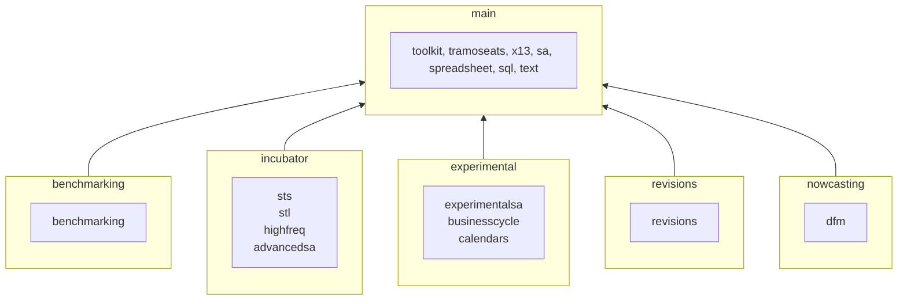

# JDemetra+ v3

**JDemetra+ is a tool for seasonal adjustment (SA)** developed by the National Bank of Belgium (NBB) in cooperation with the Deutsche Bundesbank and Eurostat in accordance with the Guidelines of the European Statistical System (ESS).

## Installing / Getting started

JDemetra+ v3 runs on any operating system that supports Java 17 or later such as Microsoft Windows, Solaris OS, Apple macOS, Ubuntu and other various Linux distributions.

The project is still in development, but you can find daily builds and install instructions at https://github.com/nbbrd/jdemetra-app-snapshot.

Its main documentation is available at https://jdemetra-new-documentation.netlify.app.

## Developing

This project is written in Java and uses Maven as a build tool.  
It requires Java 17 as minimum version and all its dependencies are hosted on Maven Central.

The code can be build using any IDE or by just type-in the following commands in a terminal:
```shell
git clone https://github.com/jdemetra/jd3-main.git
cd jd3-main
mvn clean install
```

### Structure and naming

JDemetra+ code is **divided into topics** (toolkit, x13, ...) and is **grouped by lifecycle** (main, experimental, ...).  
Each group is hosted in a separate Git repository while each topic has its own Maven module.

For example, the x13 topic can be found in the Maven module `jd3-x13-base-parent` of the repository `jd3-main`.

Here is the schema of all the groups and their topics: 



The Git repositories and the Maven modules follow this naming convention:  
`PREFIX-TOPIC[-STEREOTYPE[-CLASSIFIER]]` 

| Item       | Regex                        | Example                                 |
|------------|------------------------------|-----------------------------------------|
| PREFIX     | `\w+`                        | jd3, jdplus, ...                        |
| TOPIC      | `\w+`                        | tookit, x13, benchmarking, ...          |
| STEREOTYPE | `base&#124;cli&#124;desktop` |                                         |
| CLASSIFIER | `\w+`                        | plugin, parent, api, core, protobuf ... |

## Contributing

Any contribution is welcome and should be done through pull requests and/or issues.

## Licensing

The code of this project is licensed under the [European Union Public Licence (EUPL)](https://joinup.ec.europa.eu/page/eupl-text-11-12).
