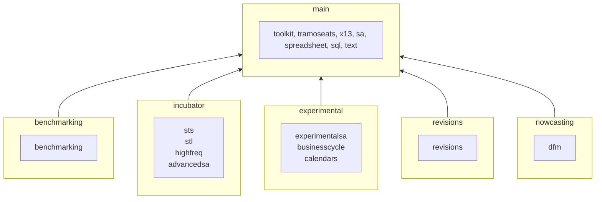

# JDemetra+ v3

[](https://github.com/jdemetra/jdplus-main/releases/latest)
[](https://github.com/jdemetra/jdplus-main/blob/develop/CHANGELOG.md)


**JDemetra+ is a seasonal adjustment and time series analysis tool** developed by the National Bank of Belgium in collaboration with the Deutsche Bundesbank, Insee and Eurostat in accordance with the [Guidelines of the European Statistical System](https://ec.europa.eu/eurostat/documents/3859598/6830795/KS-GQ-15-001-EN-N.pdf) (ESS).

Since 2015, JDemetra+ has been [officially recommended](https://ec.europa.eu/eurostat/cros/system/files/Jdemetra_%20release.pdf) to the members of the ESS and the European System of Central Banks as the software for seasonal and calendar adjustment of official statistics.

JDemetra+ implements the concepts and algorithms used in the two leading SA methods: TRAMO/SEATS and X-12ARIMA. These methods have been re-engineered using an object-oriented approach, which makes them easier to use, extend and modify.

In addition to seasonal adjustment, JDemetra+ bundles other time series models useful for the production or analysis of economic statistics, such as outlier detection, nowcasting, temporal disaggregation or benchmarking.

Version 3 offers enhanced seasonal adjustment and trend estimation capabilities, including for high frequency data.

Technically, JDemetra+ is a collection of reusable and extensible Java components, easily accessed through a rich graphical interface. The software is Free and Open Source Software (FOSS) developed under the EUPL licence.

Its main **documentation** is available at https://jdemetra-new-documentation.netlify.app.

[ [Installing](#installing) | [Developing](#developing) | [Contributing](#contributing) | [Licensing](#licensing) ]

## Installing

JDemetra+ v3 runs on any desktop operating system such as Microsoft **Windows**, **Solaris OS**, Apple **macOS**, **Ubuntu** and other various **Linux** distributions.

Platform-specific packages are provided in addition to the platform-independent packages.
These specific packages are self-sufficient and therefore don't require Java to run.

### ☕️ Bundled Java runtime

This binary provides its own Java runtime.

1. **Download** the [platform-specific package](https://github.com/jdemetra/jdplus-main/releases) (`jdemetra-standalone-VERSION-PLATFORM.zip`)

   | `PLATFORM`  | Intel            | Arm              |
   |:-----------:|------------------|------------------|
   |  **MacOS**  | `osx-x86_64`     | `osx-aarch_64`   |
   |  **Linux**  | `linux-x86_64`   | `linux-aarch_64` |
   | **Windows** | `windows-x86_64` |                  |

2. **Extract** it to any folder on your system (i.e. `DEMETRA_PATH`)
3. **Run** the executable file located in the `DEMETRA_PATH/bin` directory

### 🌟 Universal

This binary requires an external Java runtime.

1. **Install** [Java version 17 or later](https://whichjdk.com/)
2. **Download** the [platform-independent package](https://github.com/jdemetra/jdplus-main/releases) (`jdemetra-VERSION.zip`)
3. **Extract** it to any folder on your system (i.e. `DEMETRA_PATH`)
4. **Run** the executable file located in the `DEMETRA_PATH/bin` directory

## Developing

This project is written in Java and uses [Apache Maven](https://maven.apache.org/) as a build tool.  
It requires [Java 17 as minimum version](https://whichjdk.com/) and all its dependencies are hosted on [Maven Central](https://search.maven.org/).

The code can be build using any IDE or by just type-in the following commands in a terminal:
```shell
git clone https://github.com/jdemetra/jdplus-main.git
cd jdplus-main
mvn clean install
```

Daily builds are also available at https://github.com/nbbrd/jdemetra-app-snapshot.

Examples of how to use the libraries can be found at https://github.com/jdemetra/jdplus-examples/.

### Structure

JDemetra+ code is **divided into topics** (`toolkit`, `x13`, ...) and is **grouped by lifecycles** (`main`, `experimental`, ...).
Each lifecycle is hosted in a separate Git repository while each topic has its own Maven modules.

For example, the `x13` topic can be found in the `main` lifecycle.
Here is the corresponding Maven module structure in the `jdplus-main` repository:
```
jdplus-main
├─ jdplus-main-base
│  └─ jdplus-x13-base-parent
│     ├─ jdplus-x13-base-api
│     ├─ jdplus-x13-base-core
│     ├─ ...
│     └─ jdplus-x13-base-xml
├─ jdplus-main-cli
│  └─ jdplus-x13-cli-plugin
└─ jdplus-main-desktop
   └─ jdplus-x13-desktop-plugin
```

Here is the schema of all the groups and their topics: 



### Naming

Git repositories names, Maven modules artifactId, Java modules names and Java packages names follow this naming convention:
`PREFIX-TOPIC[-STEREOTYPE[-CLASSIFIER]]` 

This naming convention is enforced by the following regex pattern:
```regexp
^(jdplus)-(\w+)(?:-(base|cli|desktop|bom)(?:-(\w+))?)?$
```

## Contributing

Any contribution is welcome and should be done through pull requests and/or issues.

## Licensing

The code of this project is licensed under the [European Union Public Licence (EUPL)](https://joinup.ec.europa.eu/page/eupl-text-11-12).
 